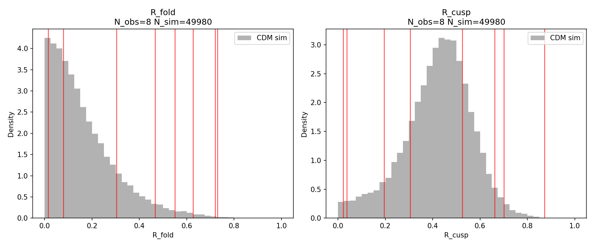
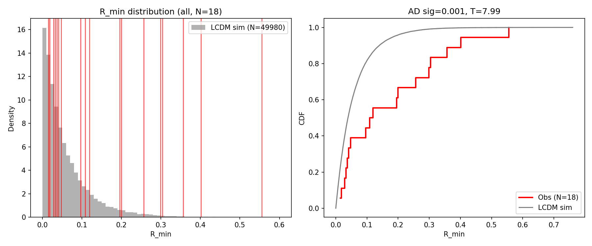
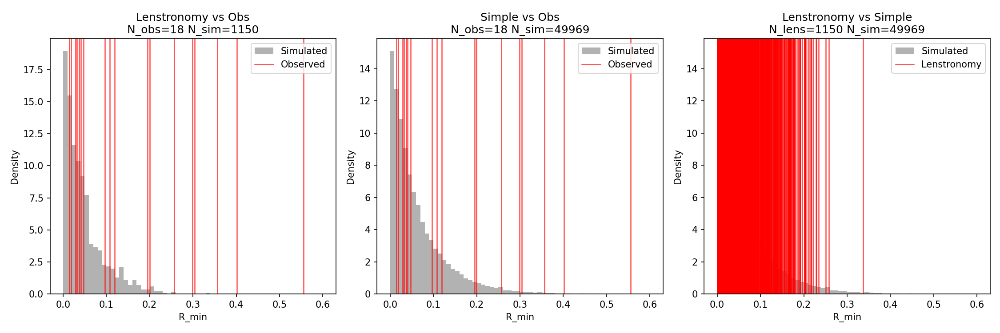

# LensFluxAnomaly

[](https://doi.org/10.5281/zenodo.20601242)

**Forward-modeling analysis of flux-ratio anomalies in 19 quadruple gravitational lenses.**

A reproducible framework that tests whether observed flux-ratio asymmetries in quad lenses deviate from the minimal LCDM expectation, using three statistics (R_min, R_fold, R_cusp), two forward models (simple perturbation + lenstronomy SIE+TNFW+LOS), and calibrated significance testing.

**Primary result:** R_fold in 8 CLASS radio quads rejects the LCDM null at AD p = 0.001 (PPC p < 10^{-4}). The anomaly is robust to selection bias, model choice, jackknife removal of any single system, and WDM. See [docs/CONCLUSIONS.md](docs/CONCLUSIONS.md) for the full summary.

---

## Key Results

| Test | Statistic | Systems | AD p | PPC p | T |
|------|-----------|---------|------|-------|----|
| Obs vs lenstronomy | R_min | 19 | < 0.001 | — | 29.3 |
| Obs vs lenstronomy | R_fold | 8 radio | < 0.001 | — | 2.37 |
| Obs vs CDM (simple) | R_fold | 8 radio | 0.001 | < 10^{-4} | 2.38 |
| Obs vs CDM (simple) | R_min | 19 | < 0.001 | — | 7.6 |
| Radio vs CDM | R_min | 8 | 0.078 | — | 6.0 |
| Jackknife R_fold | all 7-removed | 7 | all < 0.002 | — | — |

---

## Figures

**R_fold and R_cusp distributions** — observed vs CDM simple model (50,000 realizations):



**R_min distributions** — combined 19-system sample vs CDM:



**Lenstronomy cross-validation** — observed vs full SIE+TNFW+LOS pipeline (743 quads):



---

## Quick Start

```bash
git clone [this repo]
cd LensFluxAnomaly
pip install -r requirements.txt

# Core analyses (fast, ~30s each)
python run_rmin_analysis.py
python run_rfold_rcusp_analysis.py
python run_phase_f.py

# Validation (slow, ~5 min)
python run_validate_model.py --n-sim 2000 --parallel

# Robustness checks
python run_jackknife.py
python run_jackknife_rfrc.py
python run_ppc.py
python run_selection_bias.py
```

---

## Catalog

19 unique quad lens systems (8 radio + 13 optical, 2 duplicates deduplicated).

**Radio sample** (primary — CLASS/MG surveys, 5-8.5 GHz, published parity):

| System | Survey | Band | z_l | z_s | R_min | R_fold | R_cusp |
|--------|--------|------|-----|-----|-------|--------|--------|
| MG0414+0534 | MG | 8.4 GHz | 0.96 | 2.64 | 0.047 | 0.466 | 0.661 |
| B0128+437 | CLASS | 5 GHz | 0.74 | 3.13 | 0.015 | 0.015 | 0.022 |
| B0712+472 | CLASS | 5 GHz | 0.41 | 1.34 | 0.041 | 0.551 | 0.873 |
| B1422+231 | CLASS | 8.4 GHz | 0.34 | 3.62 | 0.304 | 0.304 | 0.195 |
| B1555+375 | CLASS | 5 GHz | — | — | 0.078 | 0.729 | 0.526 |
| B1608+656 | CLASS | 8.4 GHz | 0.63 | 1.39 | 0.402 | 0.079 | 0.038 |
| B1933+503 | CLASS | 8.4 GHz | 0.76 | 2.62 | 0.029 | 0.627 | 0.700 |
| B2045+265 | CLASS | 8.5 GHz | 0.87 | 1.28 | 0.108 | 0.720 | 0.306 |

**Optical sample** (diagnostic — CASTLES F814W, no parity):

HE0230-2130, MG0414+0534 (dup), RXJ0911+0551, SDSSJ0924+0219, PG1115+080, RXJ1131-1231, H1413+117, B1422+231 (dup), WFI2033-4723, Q2237+0305, HE0435-1223, SDSSJ1138+0314, HS0810+2554

---

## Project Structure

```
LensFluxAnomaly/
├── LICENSE              # BSD-3-Clause
├── CITATION.cff         # Citation metadata
├── README.md
├── config.yaml          # Central configuration
├── data/
│   ├── radio_quads.py       # 8 active radio quads + PG1115 placeholder
│   └── curated_quads.py     # 13 optical CASTLES quads
├── src/
│   ├── statistic.py         # R_fold, R_cusp implementations
│   ├── compute_rmin.py      # R_min implementation
│   ├── perturbation_model.py  # CDM simple perturbation model
│   ├── wdm_model.py         # WDM perturbation model
│   ├── selection.py         # Detection/selection model
│   ├── population.py        # Lens population sampler
│   ├── lens_model.py        # MacroLens (SIE+SHEAR) via lenstronomy
│   ├── substructure.py      # Subhalo/LOS populations
│   ├── comparison.py        # Statistical tests
│   └── catalog_utils.py     # Unified catalog builder
├── outputs/             # Results (.npz) and figures (.png)
├── docs/
│   ├── CONCLUSIONS.md       # One-page scientific summary
│   ├── PROJECT_GOAL.md      # Original project specification
│   ├── EXECUTION_PLAN.md    # Development plan
│   └── vault/               # Obsidian vault (12 files)
└── run_*.py             # Analysis entry points
```

---

## Dependencies

- Python 3.12+
- numpy, scipy, matplotlib
- astropy, pyyaml
- lenstronomy (ray tracing)
- colossus (halo concentration)

---

## Validation Summary

| Test | What it checks | Result |
|------|---------------|--------|
| Lenstronomy cross-validation | Simple model vs full SIE+TNFW+LOS | Anomaly **strengthened** |
| Jackknife (all systems) | Signal driven by single outlier? | No — all AD p < 0.002 |
| Posterior predictive check | AD reliability at N=8 | AD holds up (PPC p < 10^{-4}) |
| Selection bias test | CLASS selection correlates with R_fold? | **0% bias** confirmed |
| WDM (3/5/7 keV) | Alternative DM model rescues signal? | Makes anomaly **worse** |

---

## License

BSD 3-Clause. See [LICENSE](LICENSE).

## Citation

If you use this software, please cite:

```
Timur Kiselchuk (2026). LensFluxAnomaly v1.0.0.
GitHub: https://github.com/subBoomer/LensFluxAnomaly
```

See [CITATION.cff](CITATION.cff) for structured metadata.
